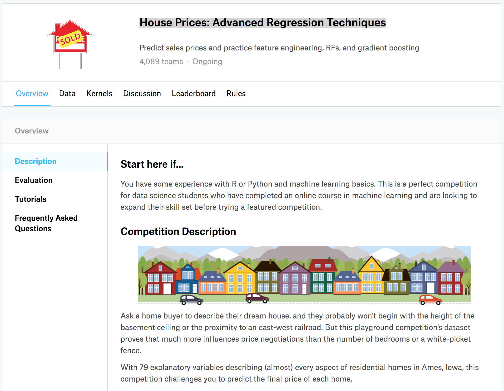

```{r setup, include=FALSE}
knitr::opts_chunk$set(echo = TRUE, fig.path = "man/figures/", message=FALSE, warning=FALSE)
```

## moderndive R Package 

[](https://cran.r-project.org/package=moderndive) 
[](https://www.tidyverse.org/lifecycle/#stable)
[](https://github.com/moderndive/moderndive/actions)
[](https://codecov.io/gh/moderndive/moderndive?branch=master)
[](http://www.r-pkg.org/pkg/moderndive)


## Overview

The [`moderndive`](https://moderndive.github.io/moderndive/) R package consists of datasets and functions for [tidyverse](https://www.tidyverse.org/)-friendly introductory linear regression. These tools leverage the well-developed `tidyverse` and `broom` packages to facilitate 

1. Working with regression tables that include confidence intervals
2. Accessing regression outputs on an observation level (e.g. fitted/predicted values and residuals)
3. Inspecting scalar summaries of regression fit (e.g. R-squared, R-squared adjusted, and mean squared error)
4. Visualizing parallel slopes regression models using `ggplot2`-like syntax. 

This R package is designed to supplement the book "Statistical Inference via Data Science: A ModernDive into R and the Tidyverse" available at [ModernDive.com](https://moderndive.com/).


***


## Installation

Get the released version from CRAN:

```{r, eval=FALSE}
install.packages("moderndive")
```

Or the development version from GitHub:

```{r, eval=FALSE}
# If you haven't installed remotes yet, do so:
# install.packages("remotes")
remotes::install_github("moderndive/moderndive")
```


***


## Basic usage

```{r, message=FALSE, warning=FALSE}
library(moderndive)
score_model <- lm(score ~ age, data = evals)
```

1. Get a tidy regression table **with confidence intervals**:
    ```{r}
get_regression_table(score_model)
    ```
2. Get information on each point/observation in your regression, including fitted/predicted values and residuals, in a single data frame:
    ```{r}
get_regression_points(score_model)
    ```
3. Get scalar summaries of a regression fit including $R^2$ and $R^2_{adj}$ but also the (root) mean-squared error:
    ```{r}
get_regression_summaries(score_model)
    ```
4. Visualize parallel slopes models using the `geom_parallel_slopes()` custom `ggplot2` geometry:
    ```{r}
library(ggplot2)
ggplot(evals, aes(x = age, y = score, color = ethnicity)) +
  geom_point() +
  geom_smooth(method = "lm", se = FALSE) +
  labs(x = "Age", y = "Teaching score", color = "Ethnicity")
    ```


***


## Six features

Why should you use the `moderndive` package for introductory linear regression? Here are six features:

1. Focus less on p-value stars, more confidence intervals
2. Outputs as tibbles
3. Produce residual analysis plots from scratch using `ggplot2`
4. A quick-and-easy Kaggle predictive modeling competition submission!
5. Visual model selection: plot parallel slopes & interaction regression models
6. Produce metrics on the quality of regression model fits

```{r, message=FALSE, warning=FALSE}
library(dplyr)
```

```{r, message=FALSE, warning=FALSE, echo=FALSE}
library(knitr)
library(broom)
library(patchwork)
```

However we first discuss the model and data background

### Data background

The data consists of end of semester student evaluations for a sample of 463 courses taught by 94 professors from the University of Texas at Austin [@diez2015openintro]. This data is included in the `evals` data frame from the `moderndive` package.

```{r, echo=FALSE}
evals_sample <- evals %>%
  select(ID, prof_ID, score, age, bty_avg, gender, ethnicity, language, rank) %>%
  sample_n(5)
```

In the following table, we present a subset of `r ncol(evals_sample)` of the `r ncol(evals)` variables included for a random sample of `r nrow(evals_sample)` courses^[For details on the remaining `r ncol(evals) - ncol(evals_sample)` variables, see the help file by running `?evals`.]:

1. `ID` uniquely identifies the course whereas `prof_ID` identifies the professor who taught this course. This distinction is important since many professors taught more than one course.
1. `score` is the outcome variable of interest: average professor evaluation score out of 5 as given by the students in this course.
1. The remaining variables are demographic variables describing that course's instructor, including `bty_avg` (average "beauty" score) for that professor as given by a panel of 6 students.^[Note that `gender` was collected as a binary variable at the time of the study (2005).]

```{r random-sample-courses, echo=FALSE}
evals_sample %>%
  kable()
```


### 1. Focus less on p-value stars, more confidence intervals

We argue that the `summary.lm()` output is deficient in an introductory statistics setting because:

1. The `Signif. codes:  0 '' 0.001 '**' 0.01 '*' 0.05 '.' 0.1 ' ' 1` only encourage **p-hacking**. In case you have not yet been convinced of the perniciousness of p-hacking, perhaps comedian [John Oliver can convince you](https://www.youtube.com/watch?v=0Rnq1NpHdmw){target="_blank"}.  
1. While not a silver bullet for eliminating misinterpretations of statistical inference, confidence intervals present students with a sense of the associated effect sizes of any explanatory variables. Thus, practical as well as statistical significance is emphasized. These are not included by default in the output of `summary.lm()`. 

Instead of `summary()`, let's use the `get_regression_table()` function:

```{r}
get_regression_table(score_model)
```

Observe how the p-value stars are omitted and confidence intervals for the point estimates of all regression parameters are included by default. By including them in the output, we can then emphasize to students that they "surround" the point estimates in the `estimate` column. Note the confidence level is defaulted to 95%; this default can be changed using the `conf.level` argument: 

```{r}
get_regression_table(score_model, conf.level = 0.99)
```


### 2. Outputs as tibbles

While one might argue that extracting the intercept and slope coefficients can be "simply" done using `coefficients(score_model)`, what about the standard errors? For example, a Google query of "_how do I extract standard errors from lm in R_" yielded results from [the R mailing list](https://stat.ethz.ch/pipermail/r-help/2008-April/160538.html){target="_blank"} and from [Cross Validated](https://stats.stackexchange.com/questions/27511/extract-standard-errors-of-coefficient-linear-regression-r){target="_blank"} suggesting we run:

```{r}
sqrt(diag(vcov(score_model)))
```

We argue that this task shouldn't be this hard, especially in an introductory statistics setting. To rectify this, the three `get_regression_*` functions  all return data frames in the tidyverse-style tibble (tidy table) format [@R-tibble]. Therefore you can extract columns using the `pull()` function from the `dplyr` package [@R-dplyr]:


```{r}
get_regression_table(score_model) %>%
  pull(std_error)
```

or equivalently you can use the `$` sign operator from base R:

```{r}
get_regression_table(score_model)$std_error
```

Furthermore, by piping the above `get_regression_table(score_model)` output into the `kable()` function from the `knitr` package [@R-knitr], you can obtain aesthetically pleasing regression tables in R Markdown documents, instead of tables written in jarring computer output font:

```{r}
get_regression_table(score_model) %>%
  kable()
```


### 3. Produce residual analysis plots from scratch using `ggplot2`

How can we extract point-by-point information from a regression model, such as the fitted/predicted values and the residuals? (Note we only display the first 10 out of 463 of such values for brevity's sake.)

```{r, eval=FALSE}
fitted(score_model)
```
```{r, echo=FALSE}
fitted(score_model)[1:10]
```
```{r, eval=FALSE}
residuals(score_model)
```
```{r, echo=FALSE}
residuals(score_model)[1:10]
```

But why have the original explanatory/predictor `age` and outcome variable `score` in `evals`, the fitted/predicted values `score_hat`, and `residual` floating around in separate vectors? Since each observation relates to the same course, we argue it makes more sense to organize them together in the same data frame using `get_regression_points()`:

```{r, eval=FALSE}
score_model_points <- get_regression_points(score_model)
score_model_points
```
```{r, echo=FALSE}
score_model_points <- get_regression_points(score_model)
score_model_points %>%
  slice(1:10)
```

Observe that the original outcome variable `score` and explanatory/predictor variable `age` are now supplemented with the fitted/predicted values `score_hat` and `residual` columns. By putting the fitted values, predicted values, and residuals next to the original data, we argue that the computation of these values is less opaque. For example, instructors can emphasize how all values in the first row of output are computed.

Furthermore, recall that since all outputs in the `moderndive` package are tibble data frames, custom residual analysis plots can be created instead of relying on the default plots yielded by `plot.lm()`. For example, we can check for the normality of residuals using the histogram of residuals shown in \autoref{fig:residuals-1}.

```{r residuals-1, fig.cap="Histogram visualizing distribution of residuals."}
# Code to visualize distribution of residuals:
ggplot(score_model_points, aes(x = residual)) +
  geom_histogram(bins = 20) +
  labs(x = "Residual", y = "Count")
```

As another example, we can investigate potential relationships between the residuals and all explanatory/predictor variables and the presence of heteroskedasticity using partial residual plots, like the partial residual plot over age shown in \autoref{fig:residuals-2}. If the term "heteroskedasticity" is new to you, it corresponds to the variability of one variable being unequal across the range of values of another variable. The presence of heteroskedasticity violates one of the assumptions of inference for linear regression. 

```{r residuals-2, fig.cap="Partial residual residual plot over age."}
# Code to visualize partial residual plot over age:
ggplot(score_model_points, aes(x = age, y = residual)) +
  geom_point() +
  labs(x = "Age", y = "Residual")
```

### 4. A quick-and-easy Kaggle predictive modeling competition submission!

With the fields of machine learning and artificial intelligence gaining prominence, the importance of predictive modeling cannot be understated. Therefore, we've designed the `get_regression_points()` function to allow for a `newdata` argument to quickly apply a previously fitted model to new observations. 

Let's create an artificial "new" dataset consisting of two instructors of age 39 and 42 and save it in a tibble data frame called `new_prof`. We then set the `newdata` argument to `get_regression_points()` to apply our previously fitted model `score_model` to this new data, where `score_hat` holds the corresponding fitted/predicted values. 

```{r}
new_prof <- tibble(age = c(39, 42))
get_regression_points(score_model, newdata = new_prof)
```

Let's do another example, this time using the Kaggle [House Prices: Advanced Regression Techniques](https://www.kaggle.com/c/house-prices-advanced-regression-techniques){target="_blank"} practice competition (\autoref{fig:kaggle-1} displays the homepage for this competition). 

```{r kaggle-1, echo=FALSE, fig.align='center', fig.cap="House prices Kaggle competition homepage.", out.width='95%', purl=FALSE}

```

This Kaggle competition requires you to fit/train a model to the provided `train.csv` training set to make predictions of house prices in the provided `test.csv` test set. We present an application of the `get_regression_points()` function allowing students to participate in this Kaggle competition. It will:

1. Read in the training and test data.
1. Fit a naive model of house sale price as a function of year sold to the training data.
1. Make predictions on the test data and write them to a `submission.csv` file that can be submitted to Kaggle using `get_regression_points()`. Note the use of the `ID` argument to use the `id` variable in `test` to identify the rows (a requirement of Kaggle competition submissions).

```r
library(readr)
library(dplyr)
library(moderndive)

# Load in training and test set
train <- read_csv("https://moderndive.com/data/train.csv")
test <- read_csv("https://moderndive.com/data/test.csv")

# Fit model:
house_model <- lm(SalePrice ~ YrSold, data = train)

# Make predictions and save in appropriate data frame format:
submission <- house_model %>%
  get_regression_points(newdata = test, ID = "Id") %>%
  select(Id, SalePrice = SalePrice_hat)

# Write predictions to csv:
write_csv(submission, "submission.csv")
```

After submitting `submission.csv` to the leaderboard for this Kaggle competition, we
obtain a "root mean squared logarithmic error" (RMSLE) score of 0.42918 as seen in \autoref{fig:kaggle-2}.

```{r kaggle-2, echo=FALSE, fig.cap="Resulting Kaggle RMSLE score."}
knitr::include_graphics("vignettes/leaderboard_orig.png")
```

### 5. Visual model selection: plot parallel slopes & interaction regression models

For example, recall the earlier visualizations of the interaction and parallel slopes models for teaching score as a function of age and ethnicity we saw in Figures \ref{fig:interaction-model} and \ref{fig:parallel-slopes-model}. Let's present both visualizations side-by-side in \autoref{fig:interaction-and-parallel-slopes-model-1}.

```{r interaction-and-parallel-slopes-model-1, echo=FALSE, fig.height = 9/3, fig.cap = "Interaction (left) and parallel slopes (right) models.", }
p1 <- ggplot(evals, aes(x = age, y = score, color = ethnicity)) +
  geom_point() +
  labs(x = "Age", y = "Teaching score", color = "Ethnicity") +
  geom_smooth(method = "lm", se = FALSE) +
  theme(legend.position = "none")
p2 <- ggplot(evals, aes(x = age, y = score, color = ethnicity)) +
  geom_point() +
  labs(x = "Age", y = "Teaching score", color = "Ethnicity") +
  geom_parallel_slopes(se = FALSE) +
  theme(axis.title.y = element_blank())
p1 + p2
```

Students might be wondering "Why would you use the parallel slopes model on the right when the data clearly form an "X" pattern as seen in the interaction model on the left?" This is an excellent opportunity to gently introduce the notion of *model selection* and *Occam's Razor*:  an interaction model should only be used over a parallel slopes model **if the additional complexity of the interaction model is warranted**. Here, we define model "complexity/simplicity" in terms of the number of parameters in the corresponding regression tables: 

```{r, eval=TRUE}
# Regression table for interaction model:
interaction_evals <- lm(score ~ age * ethnicity, data = evals)
get_regression_table(interaction_evals)

# Regression table for parallel slopes model:
parallel_slopes_evals <- lm(score ~ age + ethnicity, data = evals)
get_regression_table(parallel_slopes_evals)
```

The interaction model is "more complex" as evidenced by its regression table involving 4 rows of parameter estimates whereas the parallel slopes model is "simpler" as evidenced by its regression table involving only 3 parameter estimates. It can be argued however that this additional complexity is warranted given the clearly different slopes in the left-hand plot of \autoref{fig:interaction-and-parallel-slopes-model-1}.

We now present a contrasting example, this time from Chapter 6 of the online version of [ModernDive Subsection 6.3.1](https://moderndive.com/6-multiple-regression.html#model-selection) involving Massachusetts USA public high schools.^[For more details on this dataset, see the help file by running `?MA_schools`.] Let's plot both the interaction and parallel slopes models in \autoref{fig:interaction-and-parallel-slopes-model-2}.

```{r, eval=FALSE}
# Code to plot interaction and parallel slopes models for MA_schools
ggplot(
  MA_schools,
  aes(x = perc_disadvan, y = average_sat_math, color = size)
) +
  geom_point(alpha = 0.25) +
  labs(
    x = "% economically disadvantaged",
    y = "Math SAT Score",
    color = "School size"
  ) +
  geom_smooth(method = "lm", se = FALSE)

ggplot(
  MA_schools,
  aes(x = perc_disadvan, y = average_sat_math, color = size)
) +
  geom_point(alpha = 0.25) +
  labs(
    x = "% economically disadvantaged",
    y = "Math SAT Score",
    color = "School size"
  ) +
  geom_parallel_slopes(se = FALSE)
```

```{r interaction-and-parallel-slopes-model-2, echo=FALSE, fig.height = 9/3, fig.cap = "Interaction (left) and parallel slopes (right) models."}
p1 <- ggplot(MA_schools, aes(x = perc_disadvan, y = average_sat_math, color = size)) +
  geom_point(alpha = 0.25) +
  geom_smooth(method = "lm", se = FALSE) +
  labs(
    x = "% economically disadvantaged",
    y = "Math SAT Score",
    color = "School size"
  ) +
  theme(legend.position = "none")
p2 <- ggplot(MA_schools, aes(x = perc_disadvan, y = average_sat_math, color = size)) +
  geom_point(alpha = 0.25) +
  geom_parallel_slopes(se = FALSE) +
  labs(
    x = "% economically disadvantaged",
    y = "Math SAT Score",
    color = "School size"
  ) +
  theme(axis.title.y = element_blank())
p1 + p2
```

In terms of the corresponding regression tables, observe that the corresponding regression table for the parallel slopes model has 4 rows as opposed to the 6 for the interaction model, reflecting its higher degree of "model simplicity."

```{r}
# Regression table for interaction model:
interaction_MA <-
  lm(average_sat_math ~ perc_disadvan * size, data = MA_schools)
get_regression_table(interaction_MA)

# Regression table for parallel slopes model:
parallel_slopes_MA <-
  lm(average_sat_math ~ perc_disadvan + size, data = MA_schools)
get_regression_table(parallel_slopes_MA)
```

Unlike our earlier comparison of interaction and parallel slopes models in \autoref{fig:interaction-and-parallel-slopes-model-1}, in this case it could be argued that the additional complexity of the interaction model is *not* warranted since the 3 three regression lines in the left-hand interaction are already somewhat parallel. Therefore the simpler parallel slopes model should be favored. 

Going one step further, notice how the three regression lines in the visualization of the parallel slopes model in the right-hand plot of \autoref{fig:interaction-and-parallel-slopes-model-2} have similar intercepts. In can thus be argued that the additional model complexity induced by introducing the categorical variable school `size` is not warranted. Therefore, a simple linear regression model using only `perc_disadvan` percent of the student body that are economically disadvantaged should be favored.

While many students will inevitably find these results depressing, in our opinion, it is important to additionally emphasize that such regression analyses can be used as an empowering tool to bring to light inequities in access to education and inform policy decisions.


***


### 6. Produce metrics on the quality of regression model fits

Recall the output of the standard `summary.lm()` from earlier:

```{r, echo=FALSE}
summary(score_model)
```

Say we wanted to extract the scalar model summaries at the bottom of this output, such as $R^2$, $R^2_{adj}$, and the $F$-statistic. We can do so using the `get_regression_summaries()` function. 

```{r}
get_regression_summaries(score_model)
```

We've supplemented the standard scalar summaries output yielded by `summary()` with the mean squared error `mse` and root mean squared error `rmse` given their popularity in machine learning settings.


## The inner workings

How does this all work? Let's open the hood of the `moderndive` package.

### Three wrappers to `broom` functions {#broom-wrappers}

As we mentioned earlier, the three `get_regression_*` functions are wrappers of functions from the `broom` package for converting statistical analysis objects into tidy tibbles along with a few added tweaks, but with the introductory statistics student in mind [@R-broom]:

1. `get_regression_table()` is a wrapper for `broom::tidy()`.
1. `get_regression_points()` is a wrapper for `broom::augment()`.
1. `get_regression_summaries` is a wrapper for `broom::glance()`.

Why did we take this approach to address the initial 5 common student questions at the outset of the article?

1. By writing wrappers to pre-existing functions, instead of creating new custom functions, there is minimal re-inventing of the wheel necessary. 
1. In our experience, novice R users had a hard time understanding the `broom` package function names `tidy()`, `augment()`, and `glance()`. To make them more user-friendly, the `moderndive` package wrappers have much more intuitively named `get_regression_table()`, `get_regression_points()`, and `get_regression_summaries()`.
1. The variables included in the outputs of the above 3 `broom` functions are not all applicable to an introductory statistics students and of those that were, we found they were not intuitive for new R users. We therefore cut out some of the variables from the output and renamed some of the remaining variables. For example, compare the outputs of the `get_regression_points()` wrapper function and the parent `broom::augment()` function.

```{r, eval=FALSE}
get_regression_points(score_model)
broom::augment(score_model)
```

The source code for these three `get_regression_*` functions can be found on [GitHub](https://github.com/moderndive/moderndive/blob/master/R/regression_functions.R){target="_blank"}.

### Custom geometries

The `geom_parallel_slopes()` is a custom built `geom` extension to the `ggplot2` package. For example, the `ggplot2` webpage page gives [instructions](https://ggplot2.tidyverse.org/articles/extending-ggplot2.html){target="_blank"} on how to create such extensions. The source code for `geom_parallel_slopes()` written by [Evgeni Chasnovski](https://github.com/echasnovski){target="_blank"} can be found on [GitHub](https://github.com/moderndive/moderndive/blob/master/R/geom_parallel_slopes.R){target="_blank"}.


***


## Contributor code of conduct


Please note that this project is released with a [Contributor Code of Conduct](CONDUCT.md). By participating in this project you agree to abide by its terms.


***


## Bibliography


