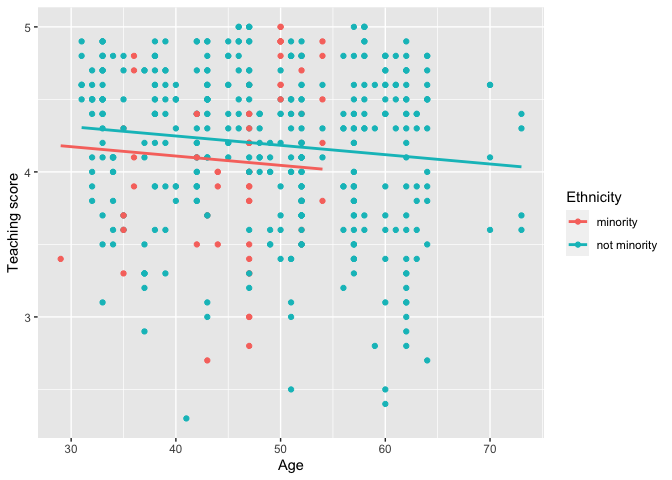

## moderndive R Package 

[](https://cran.r-project.org/package=moderndive)
[](https://zenodo.org/badge/latestdoi/115030738)
[](https://www.tidyverse.org/lifecycle/#stable)
[](https://github.com/moderndive/moderndive/actions)
[](https://codecov.io/gh/moderndive/moderndive?branch=master)
[](http://www.r-pkg.org/pkg/moderndive)

## Overview

The [`moderndive`](https://moderndive.github.io/moderndive/) R package
consists of datasets and functions for
[tidyverse](https://www.tidyverse.org/)-friendly introductory linear
regression. These tools leverage the well-developed `tidyverse` and
`broom` packages to facilitate

1.  Working with regression tables that include confidence intervals
2.  Accessing regression outputs on an observation level
    (e.g. fitted/predicted values and residuals)
3.  Inspecting scalar summaries of regression fit (e.g. R-squared,
    R-squared adjusted, and mean squared error)
4.  Visualizing parallel slopes regression models using `ggplot2`-like
    syntax.

This R package is designed to supplement the book “Statistical Inference
via Data Science: A ModernDive into R and the Tidyverse” available at
[ModernDive.com](https://moderndive.com/). For more background, read our
[Journal of Open Source Education
paper](https://doi.org/10.21105/jose.00115).

## Installation

Get the released version from CRAN:

``` r
install.packages("moderndive")
```

Or the development version from GitHub:

``` r
# If you haven't installed remotes yet, do so:
# install.packages("remotes")
remotes::install_github("moderndive/moderndive")
```

## Basic usage

``` r
library(moderndive)
score_model <- lm(score ~ age, data = evals)
```

1.  Get a tidy regression table **with confidence intervals**:
    
    ``` r
    get_regression_table(score_model)
    ```
    
        ## # A tibble: 2 x 7
        ##   term      estimate std_error statistic p_value lower_ci upper_ci
        ##   <chr>        <dbl>     <dbl>     <dbl>   <dbl>    <dbl>    <dbl>
        ## 1 intercept    4.46      0.127     35.2    0        4.21     4.71 
        ## 2 age         -0.006     0.003     -2.31   0.021   -0.011   -0.001

2.  Get information on each point/observation in your regression,
    including fitted/predicted values and residuals, in a single data
    frame:
    
    ``` r
    get_regression_points(score_model)
    ```
    
        ## # A tibble: 463 x 5
        ##       ID score   age score_hat residual
        ##    <int> <dbl> <int>     <dbl>    <dbl>
        ##  1     1   4.7    36      4.25    0.452
        ##  2     2   4.1    36      4.25   -0.148
        ##  3     3   3.9    36      4.25   -0.348
        ##  4     4   4.8    36      4.25    0.552
        ##  5     5   4.6    59      4.11    0.488
        ##  6     6   4.3    59      4.11    0.188
        ##  7     7   2.8    59      4.11   -1.31 
        ##  8     8   4.1    51      4.16   -0.059
        ##  9     9   3.4    51      4.16   -0.759
        ## 10    10   4.5    40      4.22    0.276
        ## # … with 453 more rows

3.  Get scalar summaries of a regression fit including R-squared and
    R-squared adjusted but also the (root) mean-squared error:
    
    ``` r
    get_regression_summaries(score_model)
    ```
    
        ## # A tibble: 1 x 9
        ##   r_squared adj_r_squared   mse  rmse sigma statistic p_value    df  nobs
        ##       <dbl>         <dbl> <dbl> <dbl> <dbl>     <dbl>   <dbl> <dbl> <dbl>
        ## 1     0.011         0.009 0.292 0.540 0.541      5.34   0.021     1   463

4.  Visualize parallel slopes models using the `geom_parallel_slopes()`
    custom `ggplot2` geometry:
    
    ``` r
    library(ggplot2)
    ggplot(evals, aes(x = age, y = score, color = ethnicity)) +
      geom_point() +
      geom_parallel_slopes(se = FALSE) +
      labs(x = "Age", y = "Teaching score", color = "Ethnicity")
    ```
    
    <!-- -->

## Statement of Need

Linear regression has long been a staple of introductory statistics
courses. While the curricula of introductory statistics courses has much
evolved of late, the overall importance of regression remains the same.
Furthermore, while the use of the R statistical programming language for
statistical analysis is not new, recent developments such as the
`tidyverse` suite of packages have made statistical computation with R
accessible to a broader audience. We go one step further by leveraging
the `tidyverse` and the `broom` packages to make linear regression
accessible to students taking an introductory statistics course. Such
students are likely to be new to statistical computation with R; we
designed `moderndive` with these students in mind.

## Contributor code of conduct

Please note that this project is released with a [Contributor Code of
Conduct](CONTRIBUTING.md). By participating in this project you agree to
abide by its terms.

-----

## Six features

Why should you use the `moderndive` package for introductory linear
regression? Here are six features:

1.  Focus less on p-value stars, more confidence intervals
2.  Outputs as tibbles
3.  Produce residual analysis plots from scratch using `ggplot2`
4.  A quick-and-easy Kaggle predictive modeling competition submission\!
5.  Visual model selection: plot parallel slopes & interaction
    regression models
6.  Produce metrics on the quality of regression model fits

### Data background

We first discuss the model and data background. The data consists of end
of semester student evaluations for a sample of 463 courses taught by 94
professors from the University of Texas at Austin. This data is included
in the `evals` data frame from the `moderndive` package.

In the following table, we present a subset of 9 of the 14 variables
included for a random sample of 5 courses\[1\]:

1.  `ID` uniquely identifies the course whereas `prof_ID` identifies the
    professor who taught this course. This distinction is important
    since many professors taught more than one course.
2.  `score` is the outcome variable of interest: average professor
    evaluation score out of 5 as given by the students in this course.
3.  The remaining variables are demographic variables describing that
    course’s instructor, including `bty_avg` (average “beauty” score)
    for that professor as given by a panel of 6 students.\[2\]

|  ID | prof\_ID | score | age | bty\_avg | gender | ethnicity    | language | rank         |
| --: | -------: | ----: | --: | -------: | :----- | :----------- | :------- | :----------- |
| 444 |       91 |   4.1 |  52 |    4.500 | female | not minority | english  | tenured      |
|  97 |       18 |   4.1 |  48 |    4.333 | male   | not minority | english  | teaching     |
| 340 |       70 |   4.8 |  43 |    3.500 | male   | not minority | english  | tenure track |
|  58 |       10 |   4.7 |  47 |    5.500 | male   | not minority | english  | teaching     |
| 375 |       76 |   3.7 |  43 |    4.167 | female | minority     | english  | tenured      |

### 1\. Focus less on p-value stars, more confidence intervals

We argue that the `summary.lm()` output is deficient in an introductory
statistics setting because:

1.  The `Signif. codes: 0 '' 0.001 '**' 0.01 '*' 0.05 '.' 0.1 ' ' 1`
    only encourage **p-hacking**. In case you have not yet been
    convinced of the perniciousness of p-hacking, perhaps comedian [John
    Oliver can convince
    you](https://www.youtube.com/watch?v=0Rnq1NpHdmw).  
2.  While not a silver bullet for eliminating misinterpretations of
    statistical inference, confidence intervals present students with a
    sense of the associated effect sizes of any explanatory variables.
    Thus, practical as well as statistical significance is emphasized.
    These are not included by default in the output of `summary.lm()`.

Instead of `summary()`, let’s use the `get_regression_table()` function:

``` r
get_regression_table(score_model)
```

    ## # A tibble: 2 x 7
    ##   term      estimate std_error statistic p_value lower_ci upper_ci
    ##   <chr>        <dbl>     <dbl>     <dbl>   <dbl>    <dbl>    <dbl>
    ## 1 intercept    4.46      0.127     35.2    0        4.21     4.71 
    ## 2 age         -0.006     0.003     -2.31   0.021   -0.011   -0.001

Observe how the p-value stars are omitted and confidence intervals for
the point estimates of all regression parameters are included by
default. By including them in the output, we can then emphasize to
students that they “surround” the point estimates in the `estimate`
column. Note the confidence level is defaulted to 95%; this default can
be changed using the `conf.level` argument:

``` r
get_regression_table(score_model, conf.level = 0.99)
```

    ## # A tibble: 2 x 7
    ##   term      estimate std_error statistic p_value lower_ci upper_ci
    ##   <chr>        <dbl>     <dbl>     <dbl>   <dbl>    <dbl>    <dbl>
    ## 1 intercept    4.46      0.127     35.2    0        4.13     4.79 
    ## 2 age         -0.006     0.003     -2.31   0.021   -0.013    0.001

### 2\. Outputs as tibbles

While one might argue that extracting the intercept and slope
coefficients can be “simply” done using `coefficients(score_model)`,
what about the standard errors? For example, a Google query of “*how do
I extract standard errors from lm in R*” yielded results from [the R
mailing
list](https://stat.ethz.ch/pipermail/r-help/2008-April/160538.html) and
from [Cross
Validated](https://stats.stackexchange.com/questions/27511/extract-standard-errors-of-coefficient-linear-regression-r)
suggesting we run:

``` r
sqrt(diag(vcov(score_model)))
```

    ## (Intercept)         age 
    ## 0.126778499 0.002569157

We argue that this task shouldn’t be this hard, especially in an
introductory statistics setting. To rectify this, the three
`get_regression_*` functions all return data frames in the
tidyverse-style tibble (tidy table) format. Therefore you can extract
columns using the `pull()` function from the `dplyr` package:

``` r
library(dplyr)
get_regression_table(score_model) %>%
  pull(std_error)
```

    ## [1] 0.127 0.003

or equivalently you can use the `$` sign operator from base R:

``` r
get_regression_table(score_model)$std_error
```

    ## [1] 0.127 0.003

Furthermore, by piping the above `get_regression_table(score_model)`
output into the `kable()` function from the `knitr` package, you can
obtain aesthetically pleasing regression tables in R Markdown documents,
instead of tables written in jarring computer output font:

``` r
library(knitr)
get_regression_table(score_model) %>%
  kable()
```

| term      | estimate | std\_error | statistic | p\_value | lower\_ci | upper\_ci |
| :-------- | -------: | ---------: | --------: | -------: | --------: | --------: |
| intercept |    4.462 |      0.127 |    35.195 |    0.000 |     4.213 |     4.711 |
| age       |  \-0.006 |      0.003 |   \-2.311 |    0.021 |   \-0.011 |   \-0.001 |

### 3\. Produce residual analysis plots from scratch using `ggplot2`

How can we extract point-by-point information from a regression model,
such as the fitted/predicted values and the residuals? (Note we only
display the first 10 out of 463 of such values for brevity’s sake.)

``` r
fitted(score_model)
```

    ##        1        2        3        4        5        6        7        8 
    ## 4.248156 4.248156 4.248156 4.248156 4.111577 4.111577 4.111577 4.159083 
    ##        9       10 
    ## 4.159083 4.224403

``` r
residuals(score_model)
```

    ##           1           2           3           4           5           6 
    ##  0.45184376 -0.14815624 -0.34815624  0.55184376  0.48842294  0.18842294 
    ##           7           8           9          10 
    ## -1.31157706 -0.05908286 -0.75908286  0.27559666

But why have the original explanatory/predictor `age` and outcome
variable `score` in `evals`, the fitted/predicted values `score_hat`,
and `residual` floating around in separate vectors? Since each
observation relates to the same course, we argue it makes more sense to
organize them together in the same data frame using
`get_regression_points()`:

``` r
score_model_points <- get_regression_points(score_model)
score_model_points
```

    ## # A tibble: 10 x 5
    ##       ID score   age score_hat residual
    ##    <int> <dbl> <int>     <dbl>    <dbl>
    ##  1     1   4.7    36      4.25    0.452
    ##  2     2   4.1    36      4.25   -0.148
    ##  3     3   3.9    36      4.25   -0.348
    ##  4     4   4.8    36      4.25    0.552
    ##  5     5   4.6    59      4.11    0.488
    ##  6     6   4.3    59      4.11    0.188
    ##  7     7   2.8    59      4.11   -1.31 
    ##  8     8   4.1    51      4.16   -0.059
    ##  9     9   3.4    51      4.16   -0.759
    ## 10    10   4.5    40      4.22    0.276

Observe that the original outcome variable `score` and
explanatory/predictor variable `age` are now supplemented with the
fitted/predicted values `score_hat` and `residual` columns. By putting
the fitted values, predicted values, and residuals next to the original
data, we argue that the computation of these values is less opaque. For
example, instructors can emphasize how all values in the first row of
output are computed.

Furthermore, recall that since all outputs in the `moderndive` package
are tibble data frames, custom residual analysis plots can be created
instead of relying on the default plots yielded by `plot.lm()`. For
example, we can check for the normality of residuals using the histogram
of residuals shown in .

``` r
# Code to visualize distribution of residuals:
ggplot(score_model_points, aes(x = residual)) +
  geom_histogram(bins = 20) +
  labs(x = "Residual", y = "Count")
```


As another example, we can investigate potential relationships between
the residuals and all explanatory/predictor variables and the presence
of heteroskedasticity using partial residual plots, like the partial
residual plot over age shown in . If the term “heteroskedasticity” is
new to you, it corresponds to the variability of one variable being
unequal across the range of values of another variable. The presence of
heteroskedasticity violates one of the assumptions of inference for
linear regression.

``` r
# Code to visualize partial residual plot over age:
ggplot(score_model_points, aes(x = age, y = residual)) +
  geom_point() +
  labs(x = "Age", y = "Residual")
```


### 4\. A quick-and-easy Kaggle predictive modeling competition submission\!

With the fields of machine learning and artificial intelligence gaining
prominence, the importance of predictive modeling cannot be understated.
Therefore, we’ve designed the `get_regression_points()` function to
allow for a `newdata` argument to quickly apply a previously fitted
model to new observations.

Let’s create an artificial “new” dataset consisting of two instructors
of age 39 and 42 and save it in a tibble data frame called `new_prof`.
We then set the `newdata` argument to `get_regression_points()` to apply
our previously fitted model `score_model` to this new data, where
`score_hat` holds the corresponding fitted/predicted values.

``` r
new_prof <- tibble(age = c(39, 42))
get_regression_points(score_model, newdata = new_prof)
```

    ## # A tibble: 2 x 3
    ##      ID   age score_hat
    ##   <int> <dbl>     <dbl>
    ## 1     1    39      4.23
    ## 2     2    42      4.21

Let’s do another example, this time using the Kaggle [House Prices:
Advanced Regression
Techniques](https://www.kaggle.com/c/house-prices-advanced-regression-techniques)
practice competition ( displays the homepage for this competition).

<div class="figure" style="text-align: center">


<p class="caption">

House prices Kaggle competition homepage.

</p>

</div>

This Kaggle competition requires you to fit/train a model to the
provided `train.csv` training set to make predictions of house prices in
the provided `test.csv` test set. We present an application of the
`get_regression_points()` function allowing students to participate in
this Kaggle competition. It will:

1.  Read in the training and test data.
2.  Fit a naive model of house sale price as a function of year sold to
    the training data.
3.  Make predictions on the test data and write them to a
    `submission.csv` file that can be submitted to Kaggle using
    `get_regression_points()`. Note the use of the `ID` argument to use
    the `id` variable in `test` to identify the rows (a requirement of
    Kaggle competition submissions).

<!-- end list -->

``` r
library(readr)
library(dplyr)
library(moderndive)

# Load in training and test set
train <- read_csv("https://moderndive.com/data/train.csv")
test <- read_csv("https://moderndive.com/data/test.csv")

# Fit model:
house_model <- lm(SalePrice ~ YrSold, data = train)

# Make predictions and save in appropriate data frame format:
submission <- house_model %>%
  get_regression_points(newdata = test, ID = "Id") %>%
  select(Id, SalePrice = SalePrice_hat)

# Write predictions to csv:
write_csv(submission, "submission.csv")
```

After submitting `submission.csv` to the leaderboard for this Kaggle
competition, we obtain a “root mean squared logarithmic error” (RMSLE)
score of 0.42918 as seen in .

<div class="figure">


<p class="caption">

Resulting Kaggle RMSLE score.

</p>

</div>

### 5\. Visual model selection: plot parallel slopes & interaction regression models

For example, recall the earlier visualizations of the interaction and
parallel slopes models for teaching score as a function of age and
ethnicity we saw in Figures  and . Let’s present both visualizations
side-by-side in .


Students might be wondering “Why would you use the parallel slopes model
on the right when the data clearly form an”X" pattern as seen in the
interaction model on the left?" This is an excellent opportunity to
gently introduce the notion of *model selection* and *Occam’s Razor*: an
interaction model should only be used over a parallel slopes model **if
the additional complexity of the interaction model is warranted**. Here,
we define model “complexity/simplicity” in terms of the number of
parameters in the corresponding regression tables:

``` r
# Regression table for interaction model:
interaction_evals <- lm(score ~ age * ethnicity, data = evals)
get_regression_table(interaction_evals)
```

    ## # A tibble: 4 x 7
    ##   term                    estimate std_error statistic p_value lower_ci upper_ci
    ##   <chr>                      <dbl>     <dbl>     <dbl>   <dbl>    <dbl>    <dbl>
    ## 1 intercept                  2.61      0.518      5.04   0        1.59     3.63 
    ## 2 age                        0.032     0.011      2.84   0.005    0.01     0.054
    ## 3 ethnicity: not minority    2.00      0.534      3.74   0        0.945    3.04 
    ## 4 age:ethnicitynot minor…   -0.04      0.012     -3.51   0       -0.063   -0.018

``` r
# Regression table for parallel slopes model:
parallel_slopes_evals <- lm(score ~ age + ethnicity, data = evals)
get_regression_table(parallel_slopes_evals)
```

    ## # A tibble: 3 x 7
    ##   term                    estimate std_error statistic p_value lower_ci upper_ci
    ##   <chr>                      <dbl>     <dbl>     <dbl>   <dbl>    <dbl>    <dbl>
    ## 1 intercept                  4.37      0.136     32.1    0        4.1      4.63 
    ## 2 age                       -0.006     0.003     -2.5    0.013   -0.012   -0.001
    ## 3 ethnicity: not minority    0.138     0.073      1.89   0.059   -0.005    0.282

The interaction model is “more complex” as evidenced by its regression
table involving 4 rows of parameter estimates whereas the parallel
slopes model is “simpler” as evidenced by its regression table involving
only 3 parameter estimates. It can be argued however that this
additional complexity is warranted given the clearly different slopes in
the left-hand plot of .

We now present a contrasting example, this time from Chapter 6 of the
online version of [ModernDive
Subsection 6.3.1](https://moderndive.com/6-multiple-regression.html#model-selection)
involving Massachusetts USA public high schools.\[3\] Let’s plot both
the interaction and parallel slopes models in .

``` r
# Code to plot interaction and parallel slopes models for MA_schools
ggplot(
  MA_schools,
  aes(x = perc_disadvan, y = average_sat_math, color = size)
) +
  geom_point(alpha = 0.25) +
  labs(
    x = "% economically disadvantaged",
    y = "Math SAT Score",
    color = "School size"
  ) +
  geom_smooth(method = "lm", se = FALSE)

ggplot(
  MA_schools,
  aes(x = perc_disadvan, y = average_sat_math, color = size)
) +
  geom_point(alpha = 0.25) +
  labs(
    x = "% economically disadvantaged",
    y = "Math SAT Score",
    color = "School size"
  ) +
  geom_parallel_slopes(se = FALSE)
```


In terms of the corresponding regression tables, observe that the
corresponding regression table for the parallel slopes model has 4 rows
as opposed to the 6 for the interaction model, reflecting its higher
degree of “model simplicity.”

``` r
# Regression table for interaction model:
interaction_MA <-
  lm(average_sat_math ~ perc_disadvan * size, data = MA_schools)
get_regression_table(interaction_MA)
```

    ## # A tibble: 6 x 7
    ##   term                    estimate std_error statistic p_value lower_ci upper_ci
    ##   <chr>                      <dbl>     <dbl>     <dbl>   <dbl>    <dbl>    <dbl>
    ## 1 intercept                594.       13.3      44.7     0      568.     620.   
    ## 2 perc_disadvan             -2.93      0.294    -9.96    0       -3.51    -2.35 
    ## 3 size: medium             -17.8      15.8      -1.12    0.263  -48.9     13.4  
    ## 4 size: large              -13.3      13.8      -0.962   0.337  -40.5     13.9  
    ## 5 perc_disadvan:sizemedi…    0.146     0.371     0.393   0.694   -0.585    0.877
    ## 6 perc_disadvan:sizelarge    0.189     0.323     0.586   0.559   -0.446    0.824

``` r
# Regression table for parallel slopes model:
parallel_slopes_MA <-
  lm(average_sat_math ~ perc_disadvan + size, data = MA_schools)
get_regression_table(parallel_slopes_MA)
```

    ## # A tibble: 4 x 7
    ##   term          estimate std_error statistic p_value lower_ci upper_ci
    ##   <chr>            <dbl>     <dbl>     <dbl>   <dbl>    <dbl>    <dbl>
    ## 1 intercept       588.       7.61     77.3     0       573.     603.  
    ## 2 perc_disadvan    -2.78     0.106   -26.1     0        -2.99    -2.57
    ## 3 size: medium    -11.9      7.54     -1.58    0.115   -26.7      2.91
    ## 4 size: large      -6.36     6.92     -0.919   0.359   -20.0      7.26

Unlike our earlier comparison of interaction and parallel slopes models
in , in this case it could be argued that the additional complexity of
the interaction model is *not* warranted since the 3 three regression
lines in the left-hand interaction are already somewhat parallel.
Therefore the simpler parallel slopes model should be favored.

Going one step further, notice how the three regression lines in the
visualization of the parallel slopes model in the right-hand plot of 
have similar intercepts. In can thus be argued that the additional model
complexity induced by introducing the categorical variable school `size`
is not warranted. Therefore, a simple linear regression model using only
`perc_disadvan` percent of the student body that are economically
disadvantaged should be favored.

While many students will inevitably find these results depressing, in
our opinion, it is important to additionally emphasize that such
regression analyses can be used as an empowering tool to bring to light
inequities in access to education and inform policy decisions.

### 6\. Produce metrics on the quality of regression model fits

Recall the output of the standard `summary.lm()` from earlier:

    ## 
    ## Call:
    ## lm(formula = score ~ age, data = evals)
    ## 
    ## Residuals:
    ##     Min      1Q  Median      3Q     Max 
    ## -1.9185 -0.3531  0.1172  0.4172  0.8825 
    ## 
    ## Coefficients:
    ##              Estimate Std. Error t value Pr(>|t|)    
    ## (Intercept)  4.461932   0.126778  35.195   <2e-16 ***
    ## age         -0.005938   0.002569  -2.311   0.0213 *  
    ## ---
    ## Signif. codes:  0 '***' 0.001 '**' 0.01 '*' 0.05 '.' 0.1 ' ' 1
    ## 
    ## Residual standard error: 0.5413 on 461 degrees of freedom
    ## Multiple R-squared:  0.01146,    Adjusted R-squared:  0.009311 
    ## F-statistic: 5.342 on 1 and 461 DF,  p-value: 0.02125

Say we wanted to extract the scalar model summaries at the bottom of
this output, such as R-squared, R-squared adjusted, the F-statistic, and
the degrees of freedom `df`. We can do so using the
`get_regression_summaries()` function.

``` r
get_regression_summaries(score_model)
```

    ## # A tibble: 1 x 9
    ##   r_squared adj_r_squared   mse  rmse sigma statistic p_value    df  nobs
    ##       <dbl>         <dbl> <dbl> <dbl> <dbl>     <dbl>   <dbl> <dbl> <dbl>
    ## 1     0.011         0.009 0.292 0.540 0.541      5.34   0.021     1   463

We’ve supplemented the standard scalar summaries output yielded by
`summary()` with the mean squared error `mse` and root mean squared
error `rmse` given their popularity in machine learning settings.

## The inner workings

How does this all work? Let’s open the hood of the `moderndive` package.

### Three wrappers to `broom` functions

As we mentioned earlier, the three `get_regression_*` functions are
wrappers of functions from the `broom` package for converting
statistical analysis objects into tidy tibbles along with a few added
tweaks, but with the introductory statistics student in mind:

1.  `get_regression_table()` is a wrapper for `broom::tidy()`.
2.  `get_regression_points()` is a wrapper for `broom::augment()`.
3.  `get_regression_summaries` is a wrapper for `broom::glance()`.

Why did we take this approach to address the initial 5 common student
questions at the outset of the article?

1.  By writing wrappers to pre-existing functions, instead of creating
    new custom functions, there is minimal re-inventing of the wheel
    necessary.
2.  In our experience, novice R users had a hard time understanding the
    `broom` package function names `tidy()`, `augment()`, and
    `glance()`. To make them more user-friendly, the `moderndive`
    package wrappers have much more intuitively named
    `get_regression_table()`, `get_regression_points()`, and
    `get_regression_summaries()`.
3.  The variables included in the outputs of the above 3 `broom`
    functions are not all applicable to an introductory statistics
    students and of those that were, we found they were not intuitive
    for new R users. We therefore cut out some of the variables from the
    output and renamed some of the remaining variables. For example,
    compare the outputs of the `get_regression_points()` wrapper
    function and the parent `broom::augment()` function.

<!-- end list -->

``` r
get_regression_points(score_model)
broom::augment(score_model)
```

The source code for these three `get_regression_*` functions can be
found on
[here](https://github.com/moderndive/moderndive/blob/master/R/regression_functions.R).

### Custom geometries

The `geom_parallel_slopes()` is a custom built `geom` extension to the
`ggplot2` package. For example, the `ggplot2` webpage page gives
[instructions](https://ggplot2.tidyverse.org/articles/extending-ggplot2.html)
on how to create such extensions. The source code for
`geom_parallel_slopes()` written by [Evgeni
Chasnovski](https://github.com/echasnovski) can be found on
[GitHub](https://github.com/moderndive/moderndive/blob/master/R/geom_parallel_slopes.R).

1.  For details on the remaining 5 variables, see the help file by
    running `?evals`.

2.  Note that `gender` was collected as a binary variable at the time of
    the study (2005).

3.  For more details on this dataset, see the help file by running
    `?MA_schools`.
