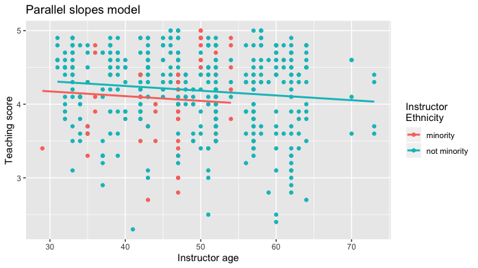
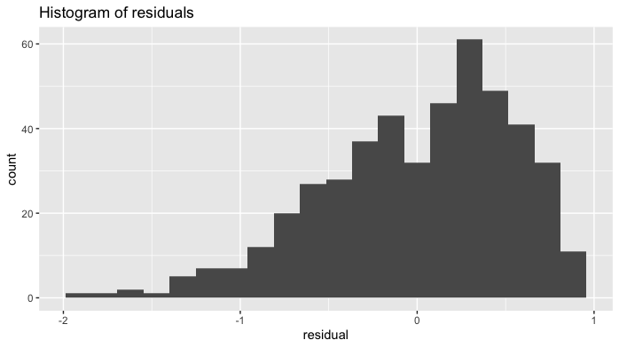
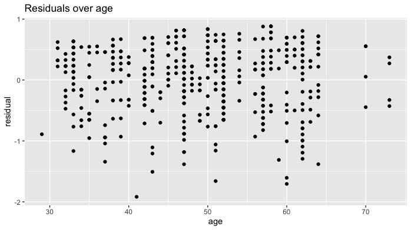

## Intro

Linear regression has long been a staple of introductory statistics courses. While the timing of when to introduce it may have changed (many argue that descriptive regression should be done ASAP and then revisited later after statistical inference has been covered), it's overall importance in the intro stats curriculum remains the same.

Let's consider data gathered from end of semester student evaluations for 463 courses (taught by 94 unique professors) from the University of Texas at Austin (see [openintro.org](https://www.openintro.org/stat/data/?data=evals){target="_blank"} for more details). Here is a random sample of 5 courses and a subset of 8 of the 13 variables included, where the outcome variable of interest is the teaching evaluation `score` out of 5 as given by students: 


  ID   score   age   bty_avg  gender   ethnicity      language   rank    
----  ------  ----  --------  -------  -------------  ---------  --------
 129     3.7    62     3.000  male     not minority   english    tenured 
 109     4.7    46     4.333  female   not minority   english    tenured 
  28     4.8    62     5.500  male     not minority   english    tenured 
 434     2.8    62     2.000  male     not minority   english    tenured 
 330     4.0    64     2.333  male     not minority   english    tenured 

The data is included in `evals` dataset in the [`moderndive`](https://moderndive.github.io/moderndive/){target="_blank"} R package for tidyverse-friendly introductory linear regression. Let's fit a regression model of teaching `score` as a function of instructor `age`:


```r
library(moderndive)
score_model <- lm(score ~ age, data = evals)
```

### Regression analysis the "good old-fashioned" way

Let's analyze the output of the fitted model `score_model` "the good old fashioned way": using `summary.lm()`.


```r
summary(score_model)
#> 
#> Call:
#> lm(formula = score ~ age, data = evals)
#> 
#> Residuals:
#>     Min      1Q  Median      3Q     Max 
#> -1.9185 -0.3531  0.1172  0.4172  0.8825 
#> 
#> Coefficients:
#>              Estimate Std. Error t value Pr(>|t|)    
#> (Intercept)  4.461932   0.126778  35.195   <2e-16 ***
#> age         -0.005938   0.002569  -2.311   0.0213 *  
#> ---
#> Signif. codes:  0 '***' 0.001 '**' 0.01 '*' 0.05 '.' 0.1 ' ' 1
#> 
#> Residual standard error: 0.5413 on 461 degrees of freedom
#> Multiple R-squared:  0.01146,	Adjusted R-squared:  0.009311 
#> F-statistic: 5.342 on 1 and 461 DF,  p-value: 0.02125
```

Here are five common student comments/questions we've heard over the years in our intro stats courses based on this output:

1. "Wow! Look at those p-value stars! Stars are good, so I must get more stars somehow."
1. "How do extract the values in the regression table?"
1. "Where are the fitted/predicted values and residuals?"
1. "How do I apply this model to a new set of data to make predictions?"
1. "What is all this other stuff at the bottom?"

### Regression analysis the tidyverse-friendly way

To address these comments/questions, we've included three functions in the `moderndive` package that takes as a fitted model as input (in this case `score_model`) and returns the same information as `summary(score_model)` but in a tidyverse-friendly way:

1. Get a tidy regression table **with confidence intervals**:
    
    ```r
    get_regression_table(score_model)
    #> # A tibble: 2 x 7
    #>   term      estimate std_error statistic p_value lower_ci upper_ci
    #>   <chr>        <dbl>     <dbl>     <dbl>   <dbl>    <dbl>    <dbl>
    #> 1 intercept    4.46      0.127     35.2    0        4.21     4.71 
    #> 2 age         -0.006     0.003     -2.31   0.021   -0.011   -0.001
    ```
2. Get information on each point/observation in your regression, including fitted/predicted values & residuals, in a single data frame:
    
    ```r
    get_regression_points(score_model)
    #> # A tibble: 463 x 5
    #>       ID score   age score_hat residual
    #>    <int> <dbl> <int>     <dbl>    <dbl>
    #>  1     1   4.7    36      4.25    0.452
    #>  2     2   4.1    36      4.25   -0.148
    #>  3     3   3.9    36      4.25   -0.348
    #>  4     4   4.8    36      4.25    0.552
    #>  5     5   4.6    59      4.11    0.488
    #>  6     6   4.3    59      4.11    0.188
    #>  7     7   2.8    59      4.11   -1.31 
    #>  8     8   4.1    51      4.16   -0.059
    #>  9     9   3.4    51      4.16   -0.759
    #> 10    10   4.5    40      4.22    0.276
    #> # … with 453 more rows
    ```
3. Get scalar summaries of a regression fit including $R^2$ and $R^2_{adj}$ but also the (root) mean-squared error:
    
    ```r
    get_regression_summaries(score_model)
    #> # A tibble: 1 x 8
    #>   r_squared adj_r_squared   mse  rmse sigma statistic p_value    df
    #>       <dbl>         <dbl> <dbl> <dbl> <dbl>     <dbl>   <dbl> <dbl>
    #> 1     0.011         0.009 0.292 0.540 0.541      5.34   0.021     2
    ```

### Visualizing parallel slopes models

Say you are plotting a scatterplot with a categorical variable mapped to the `color` aesthetic.
Using `geom_smooth(method = "lm", se = FALSE)` from the `ggplot2` package yields a visualization of an *interaction model* (different intercepts and different slopes):


```r
library(ggplot2)
ggplot(evals, aes(x = age, y = score, color = ethnicity)) +
  geom_point() +
  labs(x = "Instructor age", y = "Teaching score", color = "Instructor\nEthnicity",
       title = "Interaction model") +
  geom_smooth(method = "lm", se = FALSE)
```

<!-- -->

However, say you want to plot a *parallel slopes model*. For example, many introductory statistics textbooks start with the simpler-to-teach "common slope, different intercepts" regression model. Alas however, you can't visualize such models using `geom_smooth()`.

[Evgeni Chasnovski](https://github.com/echasnovski){target="_blank"} thus wrote a custom `geom_` extension to `ggplot2` called `geom_parallel_slopes()`. You use it just as you would any `geom_`etric object in `ggplot2`, but you need to have the `moderndive` package loaded as well:


```r
library(ggplot2)
library(moderndive)
ggplot(evals, aes(x = age, y = score, color = ethnicity)) +
  geom_point() +
  labs(x = "Instructor age", y = "Teaching score", color = "Instructor\nEthnicity",
       title = "Parallel slopes model") + 
  geom_parallel_slopes(se = FALSE)
```

<!-- -->

At this point however, students will inevitably ask a sixth question: "When would you ever use a parallel slopes model?"


### Why should you use the `moderndive` package?

We think that these functions included in the `moderndive` package are effective pedagogical tools that can help address the above six common student comments/questions. We now argue why.


------


## 1. Less p-value stars, more confidence intervals

The first common student comment/question:

> "Wow! Look at those p-value stars! Stars are good, so I must get more stars somehow."

We argue that the `summary()` output is deficient in an intro stats setting because:

* The `Signif. codes:  0 '***' 0.001 '**' 0.01 '*' 0.05 '.' 0.1 ' ' 1` only encourage **p-hacking**. In case you have not yet been convinced of the perniciousness of p-hacking, perhaps comedian [John Oliver can convince you](https://www.youtube.com/watch?v=0Rnq1NpHdmw){target="_blank"}.  
* While not a silver bullet for eliminating misinterpretations of statistical inference results, confidence intervals at least give students a sense of the practical significance and not just the statistical significance of the results. These should be included in the regression table output.

Instead of `summary()`, let's use the `get_regression_table()` function in the `moderndive` package:


```r
get_regression_table(score_model)
#> # A tibble: 2 x 7
#>   term      estimate std_error statistic p_value lower_ci upper_ci
#>   <chr>        <dbl>     <dbl>     <dbl>   <dbl>    <dbl>    <dbl>
#> 1 intercept    4.46      0.127     35.2    0        4.21     4.71 
#> 2 age         -0.006     0.003     -2.31   0.021   -0.011   -0.001
```

Confidence intervals! By including them in the output, we can easily emphasize to students that they "surround" the point estimates in the `estimate` column. Note the confidence level is defaulted to 95%. 


------


## 2. Outputs as tidy tibbles!

All the functions in the `moderndive` package return tidy tibbles! So for example, by piping the above `get_regression_table(score_model)` output into the `kable()` function from the `knitr` package, you can have aesthetically pleasing regression tables in R Markdown documents, instead of jarring computer output font:


```r
get_regression_table(score_model) %>% 
  knitr::kable()
```


term         estimate   std_error   statistic   p_value   lower_ci   upper_ci
----------  ---------  ----------  ----------  --------  ---------  ---------
intercept       4.462       0.127      35.195     0.000      4.213      4.711
age            -0.006       0.003      -2.311     0.021     -0.011     -0.001

Now let's address the second common student comment/question:

> "How do extract the values in the regression table?"

While one might argue that extracting the intercept and slope coefficients can be simply done using `coefficients(score_model)`, what about the standard errors? A Google query of "_how do I extract standard errors from lm in r_" yields results from [the R mailing list](https://stat.ethz.ch/pipermail/r-help/2008-April/160538.html){target="_blank"} and from [crossvalidated](https://stats.stackexchange.com/questions/27511/extract-standard-errors-of-coefficient-linear-regression-r){target="_blank"} suggesting we run:


```r
sqrt(diag(vcov(score_model)))
#> (Intercept)         age 
#> 0.126778499 0.002569157
```

Say what?!? It shouldn't be this hard! However since `get_regression_table()` returns a data frame/tidy tibble, you can easily extract columns using `dplyr::pull()`:


```r
get_regression_table(score_model) %>% 
  pull(std_error)
#> [1] 0.127 0.003
```

or equivalently you can use the `$` sign operator from base R:


```r
get_regression_table(score_model)$std_error
#> [1] 0.127 0.003
```


------


## 3. Birds of a feather should flock together: Fitted values & residuals

The third common student comment/question:

> "Where are the fitted/predicted values and residuals?"

How can we extract point-by-point information from a regression model, such as the fitted/predicted values and the residuals? (Note we'll only display the first 10 of such values, and not all n = 463, for brevity's sake)


```r
fitted(score_model)
```

```
#>        1        2        3        4        5        6        7        8 
#> 4.248156 4.248156 4.248156 4.248156 4.111577 4.111577 4.111577 4.159083 
#>        9       10 
#> 4.159083 4.224403
```

```r
residuals(score_model)
```

```
#>           1           2           3           4           5           6 
#>  0.45184376 -0.14815624 -0.34815624  0.55184376  0.48842294  0.18842294 
#>           7           8           9          10 
#> -1.31157706 -0.05908286 -0.75908286  0.27559666
```

But why have the original explanatory/predictor `age` and outcome variable `score` in `evals`, the fitted/predicted values `score_hat`, and `residual` floating around in separate pieces? Since each observation relates to the same instructor, wouldn't it make sense to organize them together? This is where `get_regression_points()` shines!


```r
get_regression_points(score_model)
```

```
#> # A tibble: 10 x 5
#>       ID score   age score_hat residual
#>    <int> <dbl> <int>     <dbl>    <dbl>
#>  1     1   4.7    36      4.25    0.452
#>  2     2   4.1    36      4.25   -0.148
#>  3     3   3.9    36      4.25   -0.348
#>  4     4   4.8    36      4.25    0.552
#>  5     5   4.6    59      4.11    0.488
#>  6     6   4.3    59      4.11    0.188
#>  7     7   2.8    59      4.11   -1.31 
#>  8     8   4.1    51      4.16   -0.059
#>  9     9   3.4    51      4.16   -0.759
#> 10    10   4.5    40      4.22    0.276
```

Observe that the original outcome variable `score` and explanatory/predictor variable `age` are now supplemented with the fitted/predicted value `score_hat` and `residual` columns. By putting the fitted/predicted values and the residuals next to the original data, we argue that the computation of these values is less opaque. For example in class, instructors can write out by hand how all the values in the first row, corresponding to the first instructor, are computed. 

Furthermore, recall that all outputs in the `moderndive` package are data frames/tidy tibbles, thus you can easily create custom residual analysis plots, instead of the default ones yielded by `plot(score_model)`. For example, we create:

* A histogram of all residuals to investigate normality.
* A *partial residual plot* of the relationship of the residuals vs all explanatory/predictor variables to investigate the presence of heteroskedasticity; in this case a scatterplot of the residuals over `age`.  


```r
score_model_points <- get_regression_points(score_model)

# Histogram of residuals:
ggplot(score_model_points, aes(x = residual)) +
  geom_histogram(bins = 20) +
  labs(title = "Histogram of residuals")
```

<!-- -->

```r

# Investigating patterns:
ggplot(score_model_points, aes(x = age, y = residual)) +
  geom_point() +
  labs(title = "Residuals over age")
```

<!-- -->


------


## 4. Baby's first Kaggle predictive modeling competition submission!

The fourth common student comment/question:

> "How do I apply this model to a new set of data to make predictions?"

With the fields of machine learning and artificial intelligence gaining prominence, the importance of predictive modeling cannot be understated. Therefore, we've designed the `get_regression_points()` function to allow for a `newdata` argument to quickly apply a previously fitted model to "new" observations. 

Let's create an artificial "new" dataset which is a subset of the original `evals` data with the outcome variable `score` removed and use it as the `newdata` argument:


```r
new_evals <- evals %>% 
  sample_n(4) %>% 
  select(-score)
new_evals
#> # A tibble: 4 x 13
#>      ID prof_ID   age bty_avg gender ethnicity language rank  pic_outfit
#>   <int>   <int> <int>   <dbl> <fct>  <fct>     <fct>    <fct> <fct>     
#> 1   272      51    57    5.67 male   not mino… english  tenu… not formal
#> 2   239      45    33    7    male   not mino… english  tenu… formal    
#> 3    87      16    45    4.17 male   not mino… english  tenu… not formal
#> 4   108      19    46    4.33 female not mino… english  tenu… not formal
#> # … with 4 more variables: pic_color <fct>, cls_did_eval <int>,
#> #   cls_students <int>, cls_level <fct>

get_regression_points(score_model, newdata = new_evals)
#> # A tibble: 4 x 3
#>      ID   age score_hat
#>   <int> <int>     <dbl>
#> 1     1    57      4.12
#> 2     2    33      4.27
#> 3     3    45      4.20
#> 4     4    46      4.19
```

`score_hat` are the predicted values! Let's do another example, this time using the Kaggle [House Prices: Advanced Regression Techniques](https://www.kaggle.com/c/house-prices-advanced-regression-techniques){target="_blank"} practice competition.


This Kaggle competition requires you to fit/train a model to the provided `train.csv` training set to make predictions of house prices in the provided `test.csv` test set. Here is code for a "baby's first Kaggle competition" submission that will:

1. Read in the training and test data (that we posted on GitHub).
1. Fit a naive model of house sale price as a function of year sold.
1. Write a `submission.csv` file that can be submitted to Kaggle. Note the use of the `ID` argument to indicate that a variable identifying each observational unit/row should be included. 


```r
library(tidyverse)
library(moderndive)

# Load in training and test set
train <- read_csv("https://github.com/moderndive/moderndive/raw/master/vignettes/train.csv")
test <- read_csv("https://github.com/moderndive/moderndive/raw/master/vignettes/test.csv")

# Fit model
house_model <- lm(SalePrice ~ YrSold, data = train)

# Make and submit predictions
submission <- get_regression_points(house_model, newdata = test, ID = "Id") %>% 
  select(Id, SalePrice = SalePrice_hat)
write_csv(submission, "submission.csv")
```

Submitting `submission.csv` to the leaderboard for this Kaggle competition we
get a "root mean squared logarithmic error" score of 0.42918, where smaller
scores are better:


------


## 5. Scalar summaries of linear regression model fits

The fifth common student comment/question:

> "What is all this other stuff at the bottom?"

Going back to the `summary()` from above, we figured it would be nice to be able to extract all the scalar summaries linear regression model fits. We've supplemented the standard scalar summaries output yielded by `summary()` with the mean squared error `mse` and root mean squared error `rmse` given their popularity in machine learning settings:


```r
get_regression_summaries(score_model)
#> # A tibble: 1 x 8
#>   r_squared adj_r_squared   mse  rmse sigma statistic p_value    df
#>       <dbl>         <dbl> <dbl> <dbl> <dbl>     <dbl>   <dbl> <dbl>
#> 1     0.011         0.009 0.292 0.540 0.541      5.34   0.021     2
```


## 6. Plot parallel slopes regression models

Finally, the last common student comment/question, brought to our attention by [Jenny Smetzer](https://github.com/smetzer180){target="_blank"}:

> "When would you ever use a parallel slopes model?"

For example, recall the above comparison of the visualization of the interaction model (using `geom_smooth()`) with that of the parallel slopes model (using `geom_parallel_slopes()`) for teaching score as a function of age and ethnicity:


Students might be wondering "Why would you use the parallel slopes model when the data clearly form an "X" pattern as seen in the interaction model?"

This is an excellent opportunity to gently introduce the notion of *model selection* and *Occam's Razor*: an interaction model should only be used over a parallel slopes model **if the additional complexity of the interaction model is warranted**. Here, we define model "complexity vs simplicity" in terms of the number of parameters in the corresponding regression tables: 


```r
interaction_evals <- lm(score ~ age * ethnicity, data = evals)
get_regression_table(interaction_evals)
```

term                         estimate   std_error   statistic   p_value   lower_ci   upper_ci
--------------------------  ---------  ----------  ----------  --------  ---------  ---------
intercept                       2.612       0.518       5.041     0.000      1.594      3.630
age                             0.032       0.011       2.842     0.005      0.010      0.054
ethnicitynot minority           1.995       0.534       3.735     0.000      0.945      3.045
age:ethnicitynot minority      -0.040       0.012      -3.508     0.000     -0.063     -0.018

```r
parallel_slopes_evals <- lm(score ~ age + ethnicity, data = evals)
get_regression_table(parallel_slopes_evals)
```

term                     estimate   std_error   statistic   p_value   lower_ci   upper_ci
----------------------  ---------  ----------  ----------  --------  ---------  ---------
intercept                   4.367       0.136      32.111     0.000      4.100      4.634
age                        -0.006       0.003      -2.500     0.013     -0.012     -0.001
ethnicitynot minority       0.138       0.073       1.891     0.059     -0.005      0.282

While the interaction model is "more complex" as evidenced by it's regression table involving 4 parameters/rows, as opposed to the 3 parameters of the parallel slopes model, it can be argued that this additional complexity is necessary and warranted given the clearly different slopes in the visualization of the interaction model.

Here is a contrasting example, this time from [ModernDive 6.3.1](https://moderndive.com/6-multiple-regression.html#model-selection) involving Massachusetts USA public high schools (read the help file by running `?MA_schools` for more details). Let's plot both the interaction and parallel slopes models: 


```r
ggplot(MA_schools, aes(x = perc_disadvan, y = average_sat_math, color = size)) +
  geom_point(alpha = 0.25) +
  labs(x = "Percent economically disadvantaged", y = "Math SAT Score", 
       color = "School size", title = "Interaction model") + 
  geom_smooth(method = "lm", se = FALSE)

ggplot(MA_schools, aes(x = perc_disadvan, y = average_sat_math, color = size)) +
  geom_point(alpha = 0.25) +
  labs(x = "Percent economically disadvantaged", y = "Math SAT Score", 
       color = "School size", title = "Interaction model") +
  geom_smooth(method = "lm", se = FALSE)
```


Here the additional complexity of the interaction model is *not* warranted since the 3 three regression lines are already somewhat parallel. Therefore the simpler parallel slopes model should be favored. 

In terms of the corresponding regression tables, observe that the corresponding regression table for the parallel slopes model has 4 rows as opposed to the 6 for the interaction model, reflecting its higher degree of "model simplicity."


```r
interaction_MA <- lm(average_sat_math ~ perc_disadvan * size, data = MA_schools)
get_regression_table(interaction_MA)
```

term                        estimate   std_error   statistic   p_value   lower_ci   upper_ci
-------------------------  ---------  ----------  ----------  --------  ---------  ---------
intercept                    594.327      13.288      44.726     0.000    568.186    620.469
perc_disadvan                 -2.932       0.294      -9.961     0.000     -3.511     -2.353
sizemedium                   -17.764      15.827      -1.122     0.263    -48.899     13.371
sizelarge                    -13.293      13.813      -0.962     0.337    -40.466     13.880
perc_disadvan:sizemedium       0.146       0.371       0.393     0.694     -0.585      0.877
perc_disadvan:sizelarge        0.189       0.323       0.586     0.559     -0.446      0.824

```r
parallel_slopes_MA <- lm(average_sat_math ~ perc_disadvan + size, data = MA_schools)
get_regression_table(parallel_slopes_MA)
```

term             estimate   std_error   statistic   p_value   lower_ci   upper_ci
--------------  ---------  ----------  ----------  --------  ---------  ---------
intercept         588.190       7.607      77.325     0.000    573.226    603.154
perc_disadvan      -2.777       0.106     -26.120     0.000     -2.986     -2.568
sizemedium        -11.913       7.535      -1.581     0.115    -26.736      2.909
sizelarge          -6.362       6.923      -0.919     0.359    -19.981      7.258

Going one step further, it could be argued from the visualization of the parallel slopes model, that the additional model complexity induced by introducing the categorical variable school `size` is not warranted given that the intercepts are similar! Therefore, an even simpler model of only using `perc_disadvan`: percent of the student body that are economically disadvantaged.

While many students will inevitably find these results depressing, in our opinion it is important to additionally emphasize that such regression analyses can be used as an empowering tool to bring to light inequities in access to education and inform policy decisions.


------


## The Details

### Three wrapper functions

The three `get_regression` functions are wrappers of functions from the [`broom`](https://CRAN.R-project.org/package=broom/vignettes/broom.html){target="_blank"} package for converting statistical analysis objects into tidy tibbles along with a few added tweaks:

1. `get_regression_table()` is a wrapper for `broom::tidy()`
1. `get_regression_points()` is a wrapper for `broom::augment()`
1. `get_regression_summaries` is a wrapper for `broom::glance()`

Why did we take this approach to address the 5 common student questions/comments at the outset of the article?

* By writing wrappers to pre-existing functions, instead of creating new custom functions, there is minimal "re-inventing the wheel" necessary. 
* The `broom` package function names `tidy()`, `augment()`, and `glance()` don't mean anything to intro stats students, where as the `moderndive` package function names `get_regression_table()`, `get_regression_points()`, and `get_regression_summaries()` are more intuitive.
* The default column/variable names in the outputs of the above 3 functions are a little daunting for intro stats students to interpret. We cut out some of them and renamed many of them with more intuitive names. For example, compare the outputs of the `get_regression_points()` wrapper function and the parent `broom::augment()` function.


```r
get_regression_points(score_model)
#> # A tibble: 463 x 5
#>       ID score   age score_hat residual
#>    <int> <dbl> <int>     <dbl>    <dbl>
#>  1     1   4.7    36      4.25    0.452
#>  2     2   4.1    36      4.25   -0.148
#>  3     3   3.9    36      4.25   -0.348
#>  4     4   4.8    36      4.25    0.552
#>  5     5   4.6    59      4.11    0.488
#>  6     6   4.3    59      4.11    0.188
#>  7     7   2.8    59      4.11   -1.31 
#>  8     8   4.1    51      4.16   -0.059
#>  9     9   3.4    51      4.16   -0.759
#> 10    10   4.5    40      4.22    0.276
#> # … with 453 more rows
broom::augment(score_model)
#> # A tibble: 463 x 9
#>    score   age .fitted .se.fit  .resid    .hat .sigma   .cooksd .std.resid
#>    <dbl> <int>   <dbl>   <dbl>   <dbl>   <dbl>  <dbl>     <dbl>      <dbl>
#>  1   4.7    36    4.25  0.0405  0.452  0.00560  0.542 0.00197        0.837
#>  2   4.1    36    4.25  0.0405 -0.148  0.00560  0.542 0.000212      -0.274
#>  3   3.9    36    4.25  0.0405 -0.348  0.00560  0.542 0.00117       -0.645
#>  4   4.8    36    4.25  0.0405  0.552  0.00560  0.541 0.00294        1.02 
#>  5   4.6    59    4.11  0.0371  0.488  0.00471  0.541 0.00193        0.904
#>  6   4.3    59    4.11  0.0371  0.188  0.00471  0.542 0.000288       0.349
#>  7   2.8    59    4.11  0.0371 -1.31   0.00471  0.538 0.0139        -2.43 
#>  8   4.1    51    4.16  0.0261 -0.0591 0.00232  0.542 0.0000139     -0.109
#>  9   3.4    51    4.16  0.0261 -0.759  0.00232  0.541 0.00229       -1.40 
#> 10   4.5    40    4.22  0.0331  0.276  0.00374  0.542 0.000488       0.510
#> # … with 453 more rows
```

If you're curious to see how we designed these 3 functions, take a look at the source code on  [GitHub](https://github.com/moderndive/moderndive/blob/master/R/regression_functions.R){target="_blank"}!

### Custom geom

As for `geom_parallel_slopes()`, this is a custom built `geom` extension to the `ggplot2` package. For example, the `ggplot2` webpage page gives [instructions](https://ggplot2.tidyverse.org/articles/extending-ggplot2.html){target="_blank"} on how to create such extensions. 

If you're curious to see how Evgeni did this for `geom_parallel_slopes()`, take a look at the source code on  [GitHub](https://github.com/moderndive/moderndive/blob/master/R/geom_parallel_slopes.R){target="_blank"}!


### Acknowledgements

Many thanks to Max Kuhn [\@topepo](https://github.com/topepo){target="_blank"} and Jenny Smetzer [\@smetzer180](https://github.com/smetzer180){target="_blank"} for their helpful feedback for this vignette and to Evgeni Chasnovski [\@echasnovski](https://github.com/echasnovski){target="_blank"} for contributing the `geom_parallel_slopes()` function via GitHub [pull request](https://github.com/moderndive/moderndive/pull/55){target="_blank"}.


